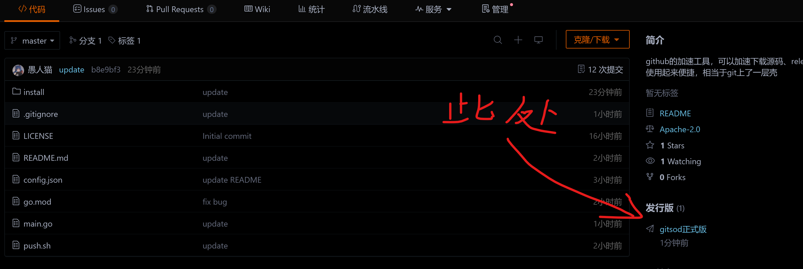
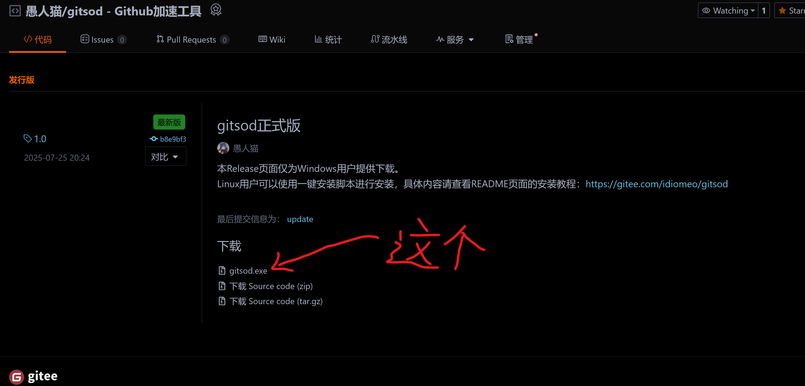
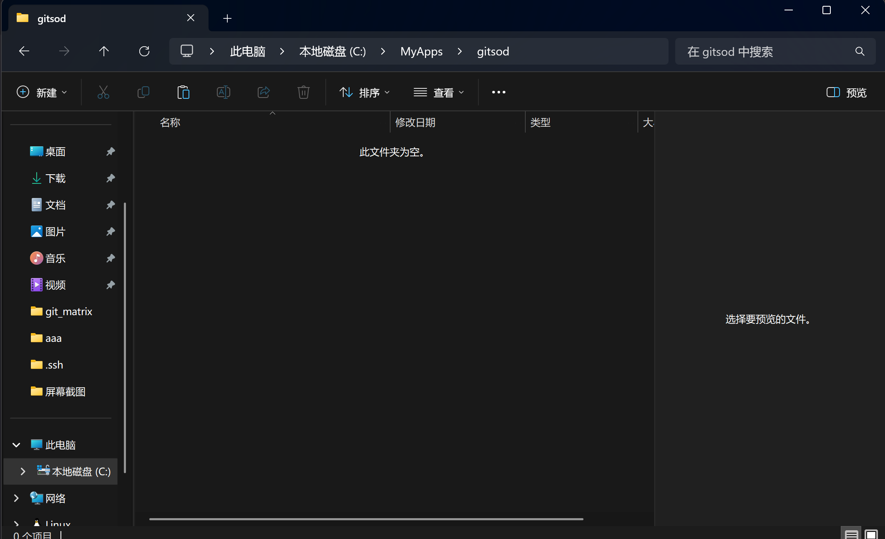
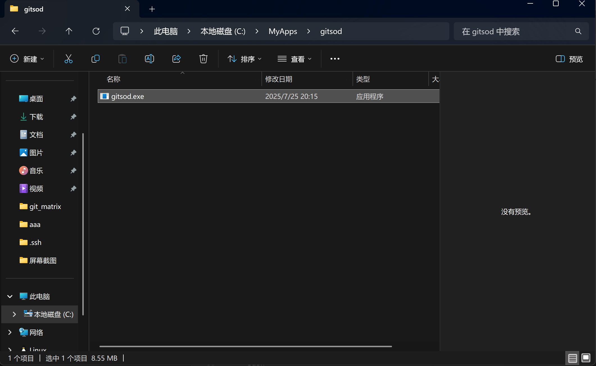
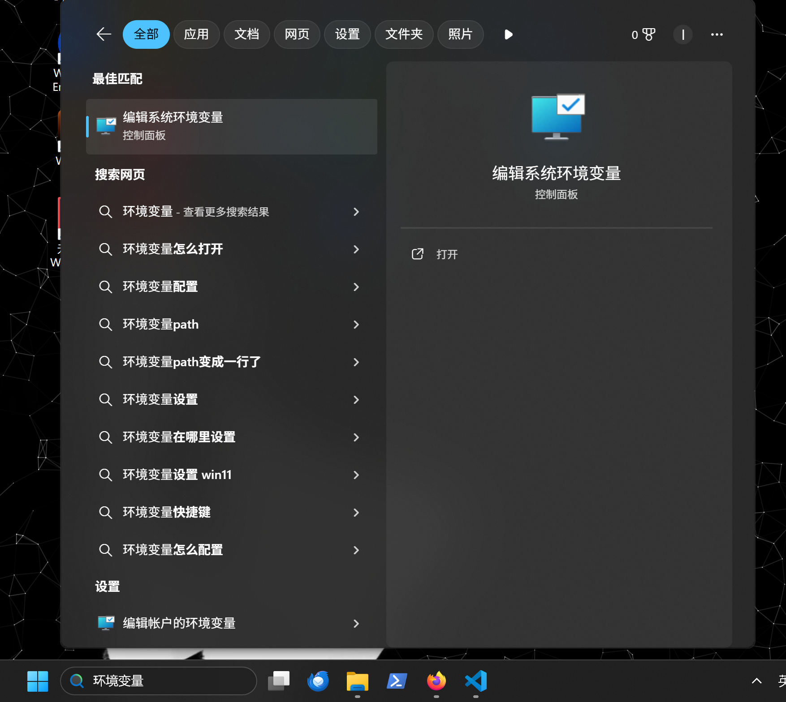
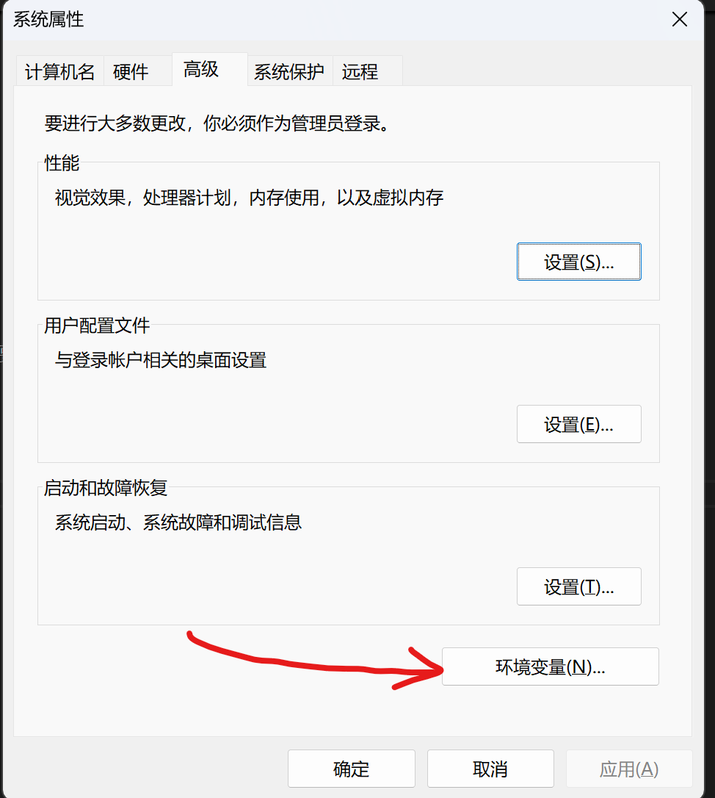
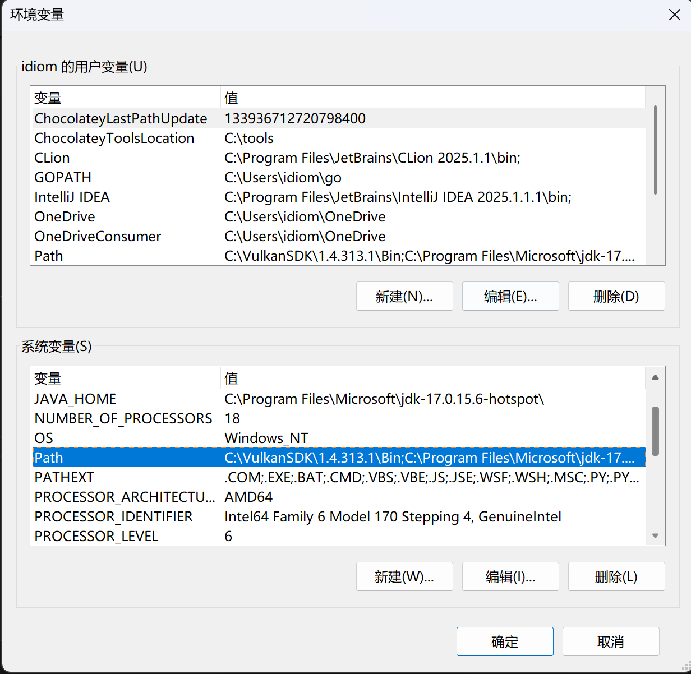
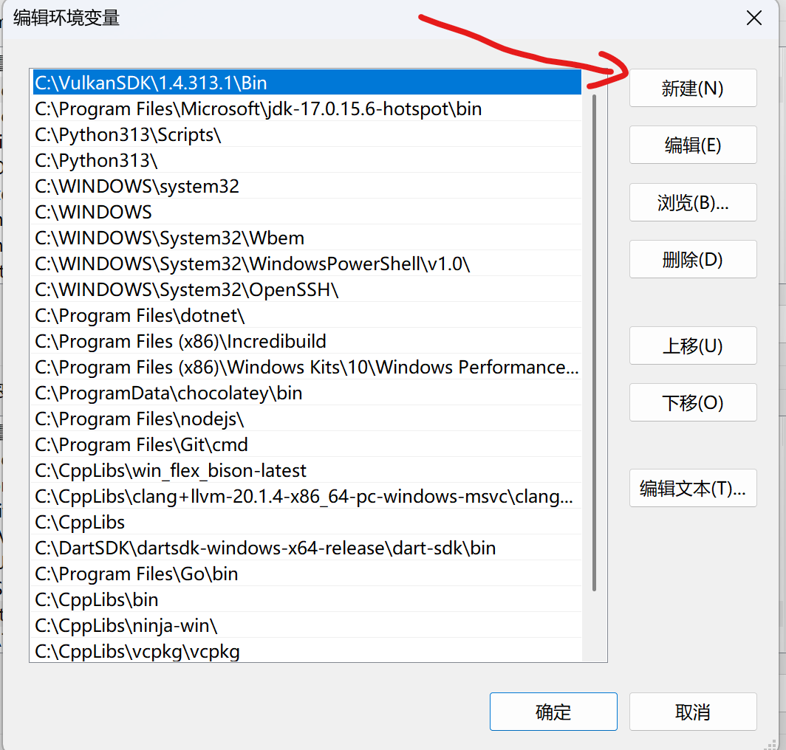
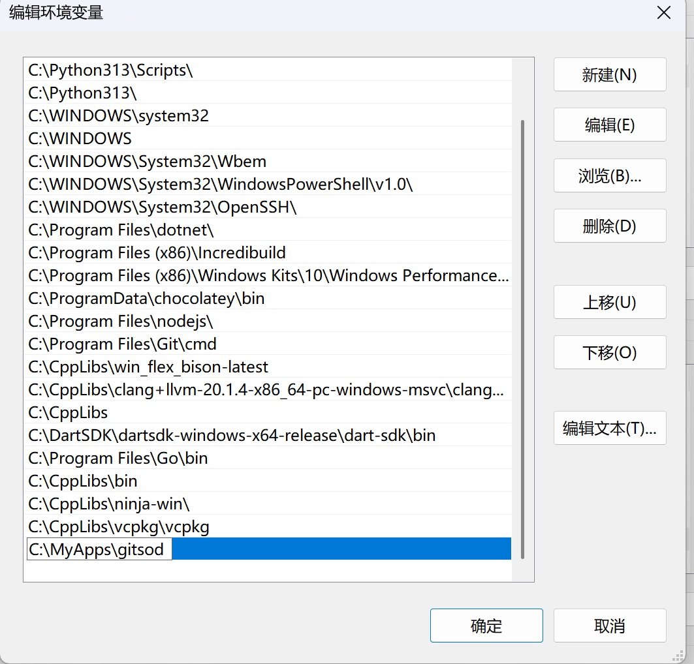

# gitsod — GitHub 加速小工具

> 一个帮你一键加速GitHub的**克隆、下载** 的命令行小工具(同时还能帮你打开Github镜像站的网址)。  

---

# 快速上手

## 1. 安装gitsod

  
### Linux
打开终端，直接执行以下命令  
```bash
curl -fsSL https://gitee.com/idiomeo/gitsod/raw/master/install/linux.sh | bash  
```  

该命令将自动拉取**一键安装脚本**进行gitsod的安装  

当脚本执行完毕，此时gitsod就已经被下载并添加为你的系统命令了。  
你可以忽略下方的Windows安装过程，[跳转到下一步](##-2.-初始化)。  


### Windows

在Windows下，安装并不是很复杂，只是步骤有点多，跟着教程慢慢来。  

#### 1. 下载gitsod
前往**Release页面**下载`gitsod.exe`文件  

  

点击`gitsod.exe`进行下载  

  


#### 2. 安置.exe文件
在一个稳定的、非临时的位置**新建一个干净的目录**   

这里是我创建的新目录，供各位参考  

  

然后将刚刚下载到的`gitsod.exe`文件拖放到该目录  

  

#### 3. 设置环境变量

在Windows的全局搜索栏中搜索`环境变量` ，**弹出来的第一个**就是我们需要用的，打开它。 

  


然后在打开的窗口中点击`环境变量`  

  

 
然后在`系统变量`的集合中找到名为`Path`的条目，**双击**打开它  

  


在新打开的窗口中点击`新建`    
    

在弹出的新条目中粘贴或填入我们刚刚用于安置`gitsod.exe`的文件夹路径
    

**不要直接关闭窗口!!!**，依次**点击确定按钮**以退出这些窗口。  

---

至此，安装结束，你可以开启你的powershell或者cmd使用`gitsod`命令了  

但先别着急，接下来只需要一个命令将其初始化后才可以正式使用    


## 2. 初始化
第一次使用时，需要输入一条指令进行初始化：
``` bash
# 拉取最新镜像配置（仅需一次）
gitsod update
```

成功后会生成 config.json，保存了当前可用的镜像地址。

## 3. 开始使用
- **克隆仓库**
  ```bash
  gitsod clone github.com/tendermint/tendermint.git
  ```
  首次克隆会提示“首次缓存镜像，请稍等”，以后再克隆同一仓库即可获得非常快的速度。

- **下载文件**
  ```bash
  gitsod download github.com/rustdesk/rustdesk/releases/download/1.4.0/rustdesk-1.4.0-x86_64.exe
  ```

- **打开Github镜像站**
    ```bash
  gitsod open
  ```

---

# 命令汇总
| 命令 | 简写 | 说明 |
|------|------|------|
| `gitsod open` | `gitsod` | 打开Github镜像站 |
| `gitsod clone <repo>` | — | 克隆仓库（支持简写 `user/repo`） |
| `gitsod download <url>` | `gitsod -d <url>` | 下载文件 |
| `gitsod update` | — | 更新gitsod本体/更新镜像配置 |
| `gitsod help` | `gitsod -h` | 查看帮助 |

---

# 常见问题

### 1. 找不到 `config.json`？
执行 `gitsod update` 即可自动拉取。

### 2. 系统没有 `git` / `wget` / `curl`？
- `git` 是 **必须** 的，请先安装。  
- 下载文件需要 `wget` 或 `curl`，如两者都没有，程序会给出可直接复制到浏览器的加速链接。

---

# 开源协议
本程序采用[**Apache License 2.0**](./LICENSE)进行代码分发。  