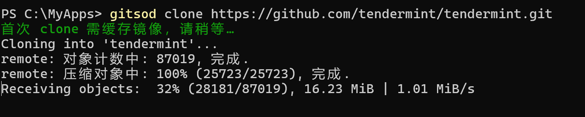
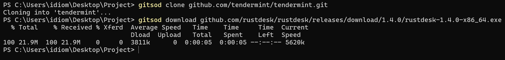

# gitsod — GitHub 加速小工具

> 一个帮你一键加速GitHub的**克隆、下载** 的命令行小工具(同时还能帮你打开Github镜像站的网址)。   

优势：  
- 学习成本极低，只需要记住2个命令即可满足GitHub的所有下载加速需求  
- 安装极其简单，Windows下有安装包，Linux下有一键安装命令     


---
效果演示：  

  

  

[Gitee仓库地址](https://gitee.com/idiomeo/gitsod)  (所有的Release文件都在Gitee仓库中发布)  
[Github仓库地址](https://github.com/idiomeo/gitsod)  

---

# 快速上手

如果你是第一次接触`gitsod`，你需要按照以下3个步骤来安装并学会使用gitsod

## 1. 安装gitsod

### Windows  

在Windows下，安装非常简单，你只需要前往[Release页面](https://gitee.com/idiomeo/gitsod/releases/)下载名为`gitsod.msi`的文件，   

这是一个自动安装程序，下载完成后双击运行，点击确认安装，gitsod将会被自动安装到`C:\Program Files\Gitsod\`目录，     
（安装目录不让自定义是为了防止小白随便选择文件夹导致目录污染）    

等待安装结束即可打开终端使用gitsod。    

  

### Linux
Linux下的安装同样简单  
打开终端，直接执行以下命令    
```bash
curl -fsSL https://gitee.com/idiomeo/gitsod/raw/master/install/linux.sh | bash  
```  

该命令将自动拉取**一键安装脚本**并自动执行进行gitsod的安装  

当脚本执行完毕，此时gitsod就已经被下载并添加为你的系统命令了。    


## 2. 初始化
第一次使用时，需要输入一条指令进行初始化:
``` bash
# 拉取最新镜像配置（仅需一次）
gitsod update
```

成功后会生成 config.json，保存了当前可用的镜像地址。

## 3. 开始使用
- **克隆仓库**
  ```bash
  gitsod clone github.com/tendermint/tendermint.git
  ```
  首次克隆会提示“首次缓存镜像，请稍等”，以后再克隆同一仓库即可获得非常快的速度。

- **下载文件**
  ```bash
  gitsod download github.com/rustdesk/rustdesk/releases/download/1.4.0/rustdesk-1.4.0-x86_64.exe
  ```

- **打开Github镜像站**
    ```bash
  gitsod open
  ```

---

# 命令汇总
| 命令 | 简写 | 说明 |
|------|------|------|
| `gitsod open` | `gitsod` | 打开Github镜像站 |
| `gitsod clone <repo>` | — | 克隆仓库（支持简写 `user/repo`） |
| `gitsod download <url>` | `gitsod -d <url>` | 下载文件 |
| `gitsod update` | — | 更新gitsod本体/更新镜像配置 |
| `gitsod help` | `gitsod -h` | 查看帮助 |

---

# 常见问题

### 1. 找不到 `config.json`？
执行 `gitsod update` 即可自动拉取。

### 2. 系统没有 `git` / `wget` / `curl`？
- `git` 是 **必须** 的，请先安装。  
- 下载文件需要 `wget` 或 `curl`，如两者都没有，程序会给出可直接复制到浏览器的加速链接。

---

# 开源协议
本程序采用[**Apache License 2.0**](./LICENSE)进行代码分发。  